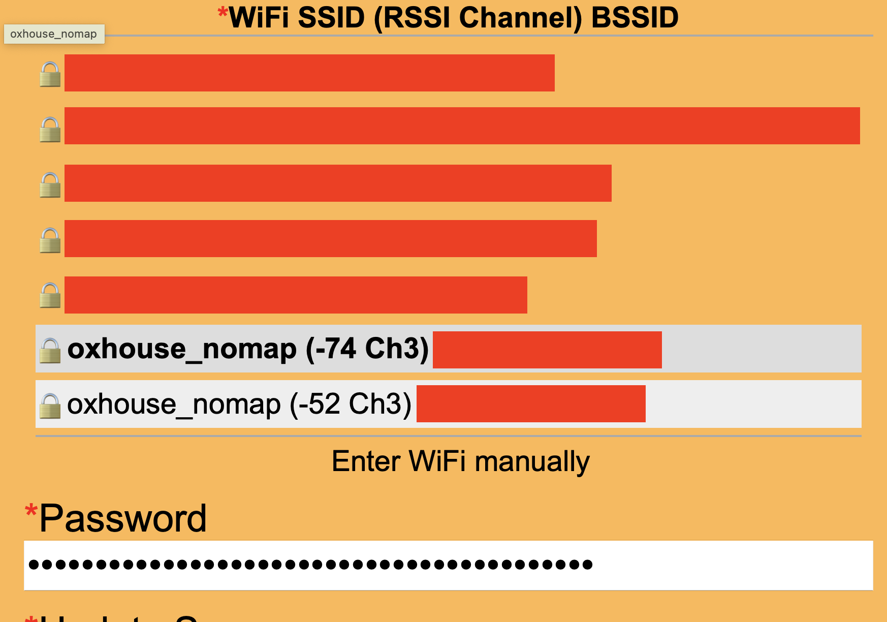
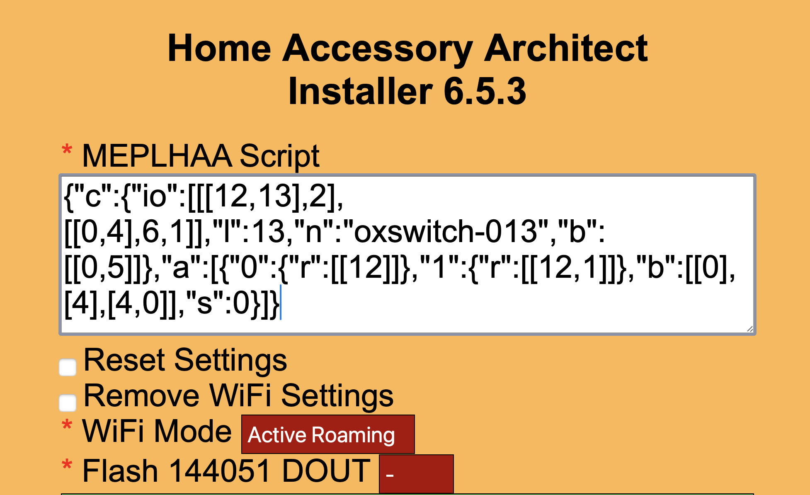
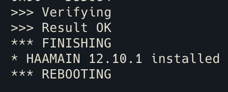
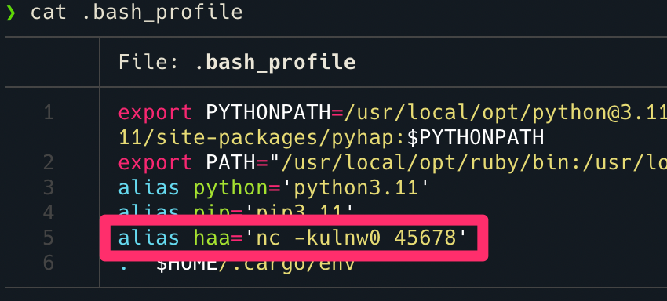

# Configuración dispositivos con el _firmware_ `haa`

1. Conectamos nuestro ordenador a la red creada por el dispositivo
2. Mediante el uso de un navegador, accedemos a la _url_ `192.168.4.1:4567` correspondiente a la dirección IP por defecto de todos los dispositivos _flasheados_ con `haa`
3. Seleccionamos nuestra red WiFi e insertamos nuestras credenciales

    

4. Seleccionamos la opción de conexión a internet que deseemos, para este ejemplo he utilziado la configuración de _roaming_ activo
5. Configuramos el _script_ de funcionamiento `melphaa` del dispositivo

    

6. Posteriormente, guardamos la configuración mediante el botón **save**
7. En este momento el dispositivo se reiniciará y comprobará si se encuentra en la última versión, en caso contrario se descargará los archivos desde el Github del proyecto
8. Para poder ver los pasos que va ejecutando el dispositivo podemos abrir un terminal y lanzar el comando `nc -kulnw0 45678` el cual nos mostrará los _logs_ del dispositivo en red

    

> [!TIP]
> Para usuarios de `linux` y `mac OS`, se puede configurar el archivo `bash_profile` para crear un alias de este comando, de esta forma se simplifica y poniendo únicmante el comando `haa` en el terminal éste ya estaría en ejecución
> 

9. Por último, se vinculará el dispositivo en la aplicación casa tal y como se detalla en el documento [homekit_connection.md](../docs/homekit_connection.md)
