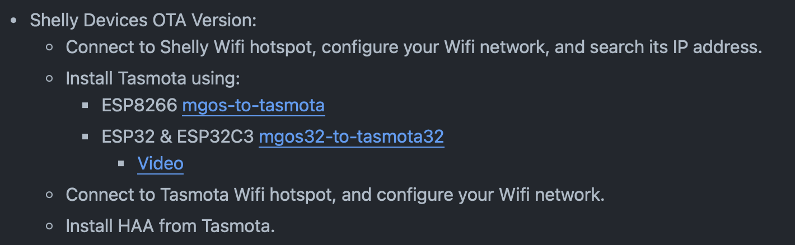
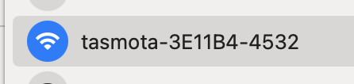

# _Flasheo_ vía OTA de los disositivos _Shelly_ PLUS, PRO y Mini

1. Acceder a la sección de [**herramientas de instalación de terceros**](https://github.com/RavenSystem/esp-homekit-devices/wiki/installation) contenida dentro de la Wiki del Github de HAA

    Se deben seguir las instrucciones detalladas en la sección correspondiente a los dispositivos _Shelly_

    

2. Conectamos el _Shelly_ a la corriente, para este ejemplo se utilizará un _Shelly_ **Plus 2 PM**
3. Buscamos la red WiFi que genera de forma automática el _Shelly_ tras alimentarlo y nos conectamos a ella

    

4. Mediante el uso del terminal podemos ver la dirección IP que ha asignado a nuestro ordenador tras conectarnos a la red WiFi por lo que se puede deducir, en base a la captura adjunta, que la dirección IP correspondiente al _Shelly_ es la `192.168.33.1`

    

5. Abrimos una pestaña en el navegador y accedemos a la dirección IP del _Shelly_
6. Pulsamos sobre el icono de WiFi, configuramos el nombre de red, el password y habilitamos la conexión mediante el uso del botón `Enable`

    

7. Desde el menú de configuración WiFi del _Shelly_ se indica al usuario cuando se ha establecido la configuración WiFi así como la dirección IP que le ha asignado el _router_ en este caso la `192.168.50.15`

    

8. Deshabilitamos el modo `Access Point` del _Shelly_

    

9. Accedemos de nuevo al menú del _Shelly_ pero esta vez accediendo a él desde la dirección IP que le ha asignado el _router_ `192.168.50.15`
10. Continuando con la explicación de la Wiki de GIthub de HAA, se indica que debemos instalar Tasmota y se indican 2 _links_ de descarga en base al modelo de `ESP`

    Para los modelos **Shelly Pro** y **Shelly Plus** se utiliza el modelo `ESP32`

    Para el modelo **Shelly Plus Mini** se utiliza el modelo `ESP32C3`

    A efectos prácticos, para cualquiera de los 3 modelos se debe acceder al mismo [link](https://github.com/tasmota/mgos32-to-tasmota32) de `Tasmosta`

11. Desde el Github de Tasmota, se indica en el README como _flashear_ el dispositivo por lo que recurrimos a los pasos detallados a continuación:
    - Prerequisitos
        1. Actualizar el `firmware` a la última versión estable. Para ello accedemos al menú de `configuración > firmware` y comprobamos/instalamos la última versión estable.

            En este caso, se instalará la versión `1.0.8`

            

            Tras finalizar la instalación el dispositivo se reconecta de forma automática

        2. Tal y como se indica en el Github, accederemos a la sección de [releases](https://github.com/tasmota/mgos32-to-tasmota32/releases) de tasmota para descargar el archivo de actualización correspondiente con nuestro dispositivo.

            Desde la lista de **releases** descagaremos el archivo `...tasmota32-Plus2PM.zip` correspondiente a nuestro dispositivo.

    - Instalación
        1. Acceder a la sección `Settings > Firmware` del Shelly y subir el archivo `.zip` descargado
        2. Si la instalación ha finalizado correctamente, el _Shelly_ se reiniciará en modo AP emitiendo un ssid llamado “Tasmota…” tal y como se muestra en la imagen adjunta, en caso contrario, se volverá a cargar la web de _Shelly_ y se deberá repetir la actualización con el paquete de actualización *custom*

            

        3. Posteriormente nos conectamos al dispositivo en el rango de la dirección IP que asigna el AP
12. Desde el menú de `Tasmota`, configuramos el acceso a nuestra red y tras pulsar en **Save** el dispositivo se conectará automáticamente a nuestra red WiFi

    

13. Continuamos con el paso **8** detallador en el `README.md` del Github de Tasmota. Para ello, se debe acceder acceder al menú `Configuración > Auto-Configuración` y seleccionar, posteriormente, nuestro dispositivo de la lista desplegable.

    Tras aceptar la configuración, el dispositivo se reiniciará y reconectará automáticamente.

> [!WARNING]
> Este paso es muy importante y crítico. De no realizarlo correctamente el dispositivo se puede quedar bloqueado y se requiere del flasheo vía hardware

14. En este punto del proceso de _flasheo_ abandonamos el Github de Tasmosta y proseguimos con la explicación del Github de HAA.
15. Antes de conectarnos al dispositivo para seguir con la instalación, se debe acceder al _link_ de [***releases***](https://github.com/RavenSystem/haa/releases) del Github de HAA y descargar los 2 archivos necesarios para configurar el dispositivo `haaboot_esp32...bin` y `otamain_esp32...bin`
    - Para los dispositivos _Shelly_ **Mini** se deben seleccionar los archivos con el sufijo `c3`
    - Para los dispositivos _Shelly_ Plus y Pro se deben seleccionar los archivos con el sufijo `_1`

    Para el ejemplo (correspondiente a una **Shelly Plus 2 PM**), se seleccionarán los archivos `haaboot_esp32_1.bin` y `otamain_esp32_1.bin`

16. Accedemos al menú de `Update > Upgrade by file upload` de Tasmota y subimos el archivo `haaboot_esp32_1`.
17. Tras finalizar la actualización, el dispositivo se reiniciará y se creará un AP con la red `HAA`

    

> [!NOTE]
> Existe la posibilidad que este paso no funcione correctamente. Si tras el reinicio vuelve aparecer el menú de `Tasmosta` y por ende no se genera la red WiFi HAA, se deberá repetir el paso anterior (paso 16) pero esta vez actualizando el dispositivo mediante el uso del archivo* `otamain_esp32_1.bin`

18. Llegados a este punto, el dispositivo ya está _flasheado_ vía OTA con `haa` y se puede iniciar la configuración tal y como se detalla en la guía [config_haa.md](../docs/config_haa.md)
