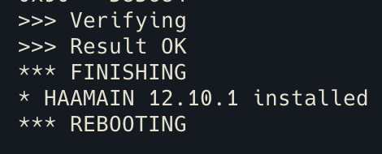

# _Flash_ Sonoff devices

A continuación se detellan los pasos a seguir para poder _flashear_ los dispositivos de la marca *Sonoff*

## Pasos previos

1. Instalar `esptool` desde su carpeta mediante la ejecución del comando:

    ```python
    python3 setup.py install
    ```

2. Descargar `fullhaaboot.bin` (página de [descarga](https://github.com/RavenSystem/haa/releases/latest/download/fullhaaboot.bin))
3. Conectar RS-232 al Sonoff Basic

    :warning:  **NOTE**: Los pines RX y TX van cruzados con la PCB FTDI custom :warning:

## _Flasheo_ del dispositivo

1. Mantener pulsado el botón del Sonoff y conectar el conversor **RS-232**
2. Creamos un _script_ en `python` con el nombre `usb_detect.py` y que contenga la información abajo detallada. Este _script_ nos servirá en los próximos pasos para detectar el puerto USB al que se conecta el dispositivo:

    ```python
    import glob
    print(glob.glob('/dev/tty.*'))
    ```

3. Localizar el puerto serie al que esta conectado el dispositivo mediante el _script_:

    ```bash
    python usb_detect.py
    ```

4. Creamos un _backup_ del _firmware_ original del Sonoff Basic desde el terminal:

    ```bash
    esptool.py -p /dev/tty.usbserial-144240 read_flash 0x00000 0x100000 fwbackup.bin
    ```

    :warning: **NOTE**: Si aparece una excepción al ejecutar el comando, añadir `python3` delante del comando `esptool` :warning:

    Resultado mostrado tras la ejecución del comando:

    ```bash
    esptool.py v2.8
    Serial port /dev/tty.usbserial-14310
    Connecting....
    Detecting chip type... ESP8266
    Chip is ESP8285
    Features: WiFi, Embedded Flash
    Crystal is 26MHz
    MAC: 70:03:9f:47:e8:0b
    Uploading stub...
    Running stub...
    Stub running...
    1048576 (100 %)
    1048576 (100 %)
    Read 1048576 bytes at 0x0 in 95.8 seconds (87.5 kbit/s)...
    Hard resetting via RTS pin...
    ```

5. Quitamos la alimentación del dispositivo
6. Mantener pulsado el botón del dispositvo y volver a conectar la alimentación
7. Borramos el _firmware_ del dispositivo:

    ```bash
    esptool.py -p /dev/tty.usbserial-144240 erase_flash
    ```

    Resultado mostrado tras la ejecución del comando:

    ```bash
    esptool.py v2.8
    Serial port /dev/tty.usbserial-143240
    Connecting....
    Detecting chip type... ESP8266
    Chip is ESP8285
    Features: WiFi, Embedded Flash
    Crystal is 26MHz
    MAC: 24:a1:60:10:0e:79
    Uploading stub...
    Running stub...
    Stub running...
    Erasing flash (this may take a while)...
    Chip erase completed successfully in 1.2s
    Hard resetting via RTS pin...
    ```

8. Quitamos la alimentación del dispositivo
9. Mantener pulsado el botón del dispositvo y volver a conectar la alimentación
10. Subimos el _firmware_ del HAA ejecutando el comando adjunto desde la carpeta dónde tenemos ubicado el archivo `fullhaaboot.bin`

    ```bash
    esptool.py -p /dev/tty.usbserial-144240 --baud 115200 write_flash -fs 1MB -fm dout -ff 40m 0x0 fullhaaboot.bin
    ```

    Resultado mostrado tras la ejecución del comando:

    ```bash
    esptool.py v2.8
    Serial port /dev/tty.usbserial-143240
    Connecting....
    Detecting chip type... ESP8266
    Chip is ESP8285
    Features: WiFi, Embedded Flash
    Crystal is 26MHz
    MAC: 24:a1:60:10:0e:79
    Uploading stub...
    Running stub...
    Stub running...
    Configuring flash size...
    Compressed 607712 bytes to 434475...
    Wrote 607712 bytes (434475 compressed) at 0x00000000 in 42.1 seconds (effective 115.6 kbit/s)...
    Hash of data verified.

    Leaving...
    Hard resetting via RTS pin...
    ```

11. Quitamos la alimentación del dispositivo
12. Mantener pulsado el botón del dispositvo y volver a conectar la alimentación
13. Tras el _flasheo_ y el reinicio del dispositivo, este arrancará generando un red WiFi con el prefijo **HAA-**.
    Establecemos conexión WiFi con dicha red y accederemos a la dirección IP `192.168.4.1:4567`

## Configuración

1. Conectamos nuestro ordenador a la red creada por el dispositivo
2. Mediante el uso de un navegador, accedemos a la _url_ `192.168.4.1:4567` correspondiente a la dirección IP por defecto de todos los dispositivos _flasheados_ con `haa`
3. Seleccionamos nuestra red WiFi e insertamos nuestras credenciales

    

4. Seleccionamos la opción de conexión a internet que deseemos, para este ejemplo he utilziado la configuración de _roaming_ activo
5. Configuramos el _script_ de funcionamiento `melphaa` del dispositivo

    

6. Posteriormente, guardamos la configuración mediante el botón **save**
7. En este momento el dispositivo se reiniciará y comprobará si se encuentra en la última versión, en caso contrario se descargará los archivos desde el Github del proyecto
8. Para poder ver los pasos que va ejecutando el dispositivo podemos abrir un terminal y lanzar el comando `nc -kulnw0 45678` el cual nos mostrará los _logs_ del dispositivo en red

    


