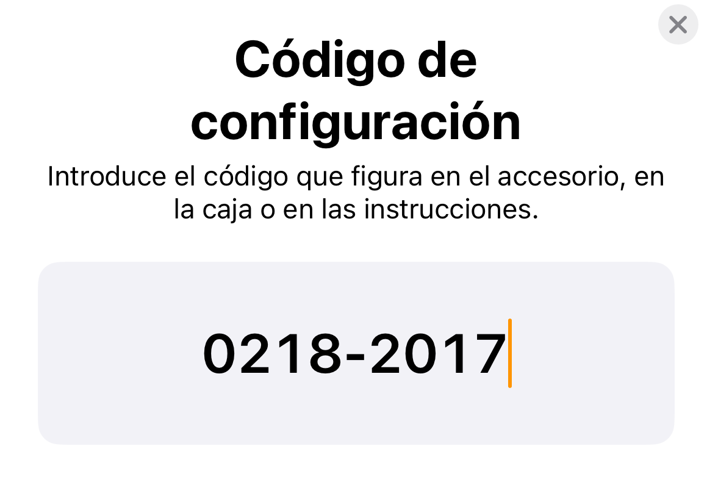
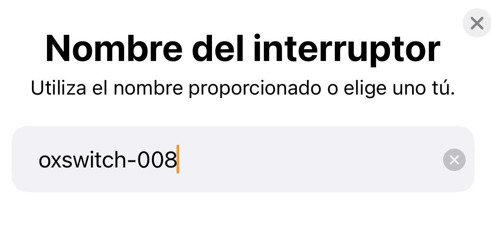
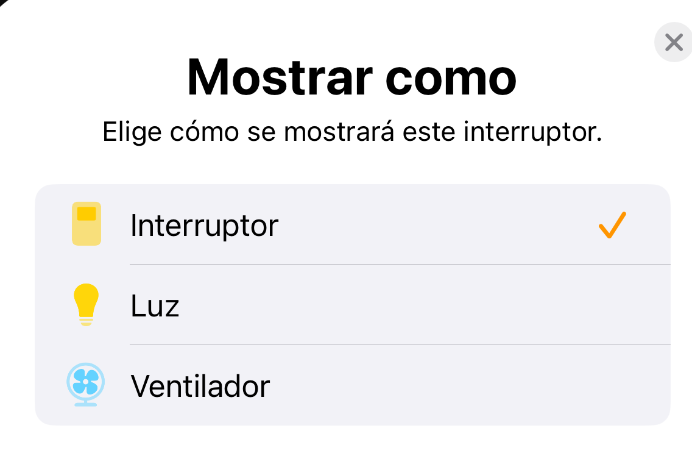

# Conexión de un dispositivo `haa` con homekit

1. Seleccionar el botón **+** (esquina superior derecha) y pulsar en la opción `Añadir accesorio`

    

2. Pulsamos en el botón `Más opciones`

    

3. Aparecerá una ventana dónde se mostrará el nuevo dispositivo, listo para vincularse con la aplicación

    

4. Aceptamos el mensaje informativo de que el dispositivo no está certificado por Apple e introducimos el código de configuración, el cual para los dispositivos con _firmware_ `haa` siempre es el **0218-2017**

    

5. Por último, seleccionamos la habitación dónde se instalará el dispositivo, el nombre que aparecerá en la aplicación y el icono para mostrar dicho dispositivo en la aplicación.

    
    
    
