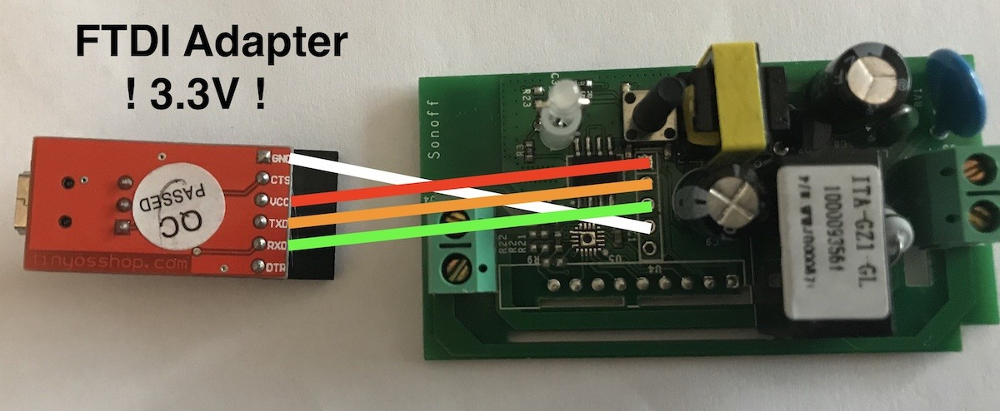
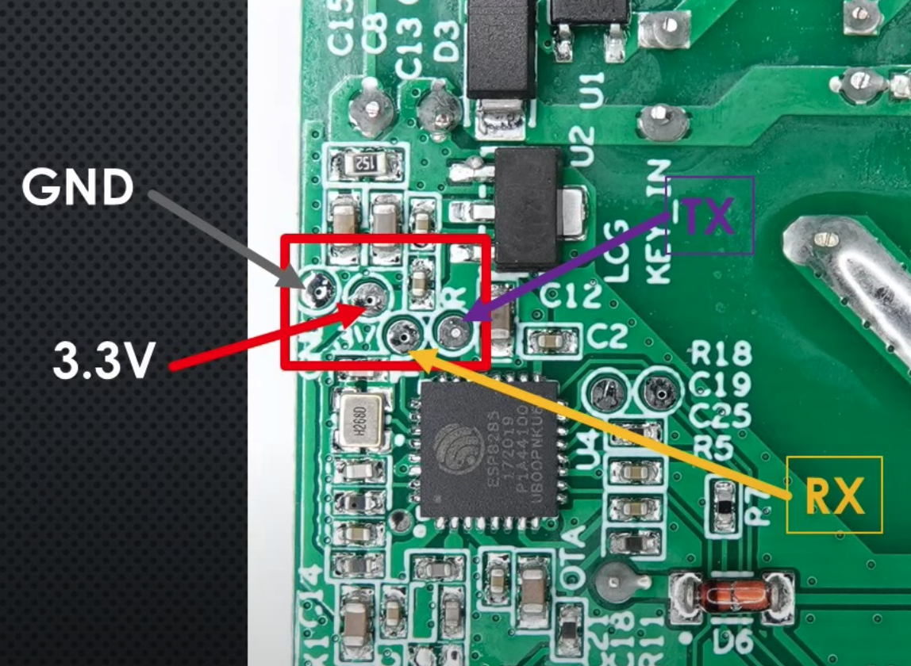
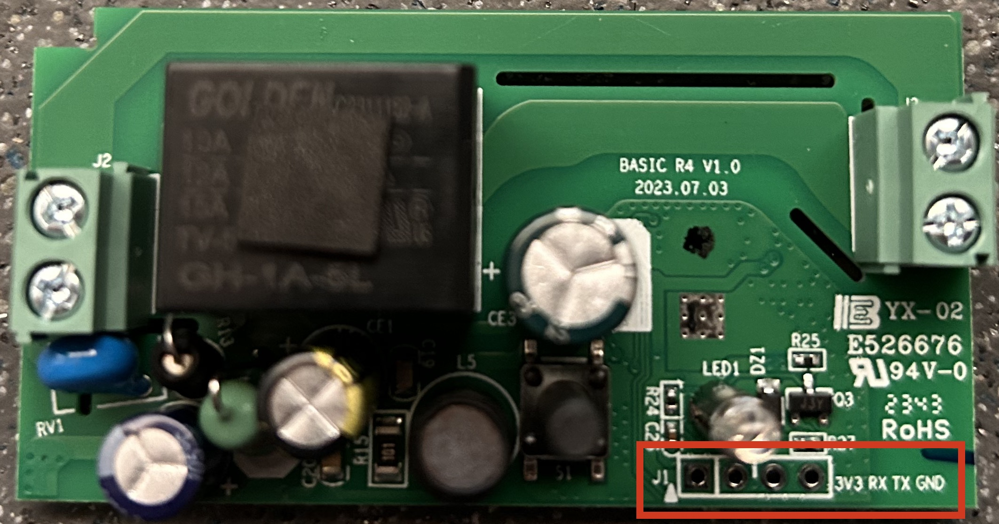

# Resumen de conexiones _hardware_ correspondiente a diversos dispositivos de la marca Sonoff

Sonoff Basic

Sonoff mini R2

|Sonoff Mini R2|USB RS-232|
| ------------ | -------- |
|+3.3V|+3.3V|
|GND|GND|
|RX|RX|
|TX|TX|

Sonoff Basic R4

|Sonoff Basic R4|USB RS-232|
| ------------ | -------- |
|+3.3V|+3.3V|
|GND|GND|
|RX|TX|
|TX|RX|

