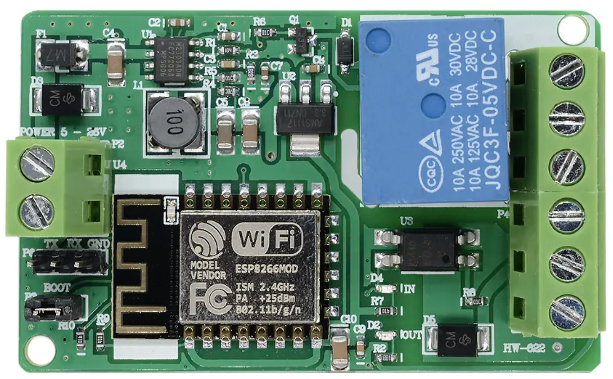

# Gestión relé con ESP8266EX Relay Board 10A DC 7-30V



## Control del relé integrado en la PCB

`MEPLHAA` está diseñado para gestionar la PCB detallada en el [ESP8266EX Wi-Fi 10A DC 7-30V](../docs/esp_relay_pinout.md)
Se activa y desactiva relé tanto desde el interruptor (Jumper P3 de la PCB) como desde Homekit

### `Melphaa` _script_ para configurar al dispositivo

```json
{"c": {"io": [[[4], 2],[[0], 6, 1]],"l": 13,"n": "device-hostname","b": [[0, 5]]},"a": [{"0": {"r": [[4]]},"1": {"r": [[4, 1]]},"b": [[0]],"s": 0}]}
```

### Descripción del _script_

```json
{
  "c": {
    "io": [                   // Configuración de los GPIO's
      [[4], 2],               // Se seleccionan los GPIO 4 como pines de salida
      [[0], 6, 1]             // Se seleccionan los GPIO 0 como el pin de entrada con la resistencia de pull-up interna habilitada y señal invertida
    ],
    "l": 13,                  // Se selecciona el GPIO 13 como led de estado del dispositivo
    "n": "device-hostname",   // Hostname del dispositivo
    "b": [[0, 5]]             // Se selecciona el GPIO 0 para activar el modo setup tras mantener pulsado el botón 8 segundos (opción 5)
  },
  "a": [
    {                         // Como no se espifica la variable "t" (tipo de servicio), se configura como un accesorio del tipo switch (valor por defecto)
      "0": {                  // Configuración acción cuando el switch de Homekit está a OFF
        "r": [[4]]            // Se cambia el estado a OFF del relé conectado a la GPIO 4 hasta que vuelva a activarse
      },
      "1": {                  // Configuración acción cuando el switch de Homekit está a ON
        "r": [[4, 1]]         // Se cambia el estado a ON del relé conectado a la GPIO 4
      },
      "b": [                  // Configuración de los botones, el cual debe ser una array
        [0]                   // Primer botón conectado al GPIO 0 como "pulsación simple" (valor por defecto al no estar especificado)
      ],
      "s": 0                  // Estado inicial apagado
    }
  ]
}
```
