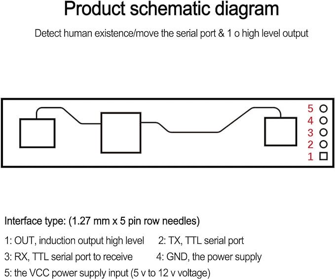

# LD2410 detector de presencia humana


> [!NOTE]
> El conexionado del dispositivo para _flashearlo_ se realiza conectando el cable USB directamente a la PCB
>
> La guía para _flashear_ el dispositivo es [Flasheo HAA](../docs/flash_haa.md)
>
> Carcasa impresa en 3D para poder ensamblar el sensor [Skadis LD2410](https://www.thingiverse.com/thing:6429958)

## Control del sensor de presencia humana

El _script_ adjunto se define para gestionar un sensor de presencia humana.
Para integrar el sensor con Homekit, se ha recurrido al uso de un Wemos mini D1, al cual se le ha conectado el pin de salida `out` del sensor **LD2410** al pin D2 (GPIO4)



### `Melphaa` _script_ para configurar al dispositivo

```json
{"c":{"io":[[[4],6]],"n":"device-hostname"},"a":[{"t":6,"f0":[{"g":4,"t":0}],"f1":[{"g":4,"t":1}]}]}
```

### Descripción del _script_

```json
{
  "c": {
    "io": [                     // Configuración de los GPIO's
      [[4],6]                   // Se selecciona el GPIO 4 como pin de entrada con la resistencia de pull-up interna deshabilitada (señal 0 no indicada ya que se usa el valor por defecto para aligerar el MELPHAA)
    ],
    "n": "device-hostname"     // Hostname del dispositivo
  },
  "a": [
    {
      "t": 6,                   // Configuración del accesorio como Sensor de Presencia
      "f0": [                   // Gestión del pin cuando el valor del sensor de presencia es OFF.
        {"g": 4,"t": 0}
      ],
      "f1": [                   // Gestión del pin cuando el valor del sensor de presencia es OFF.
        {"g": 4,"t": 1}
      ]
    }
  ]
}
```
