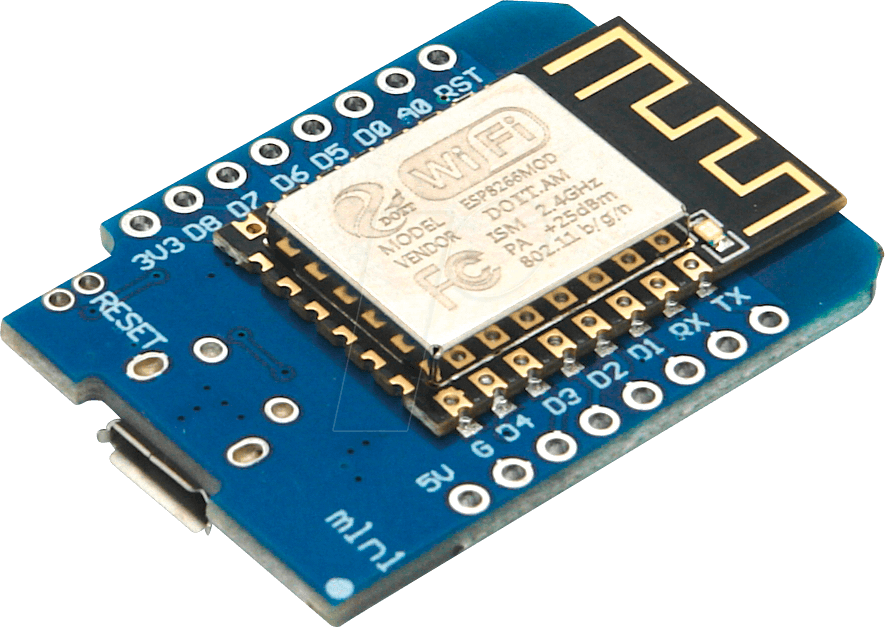

# Gestión WLED con Wemos mini D1 y HAA



> [!NOTE]
> El conexionado del dispositivo para _flashearlo_ se realiza conectando el cable USB directamente a la PCB
>
> La guía para _flashear_ el dispositivo es [Flasheo HAA](../docs/flash_haa.md)

## Control de WLED desde HAA

El _script_ adjunto se encarga de crear un accesorio del tipo _lightbulb_ que permite controlar, vía HTTP Response API, otro ESP con WLED.
EL accesorio dispone de diversos _extra services_ para poder lanzar diversos efectos pre configurados en WLED

### `Melphaa` _script_ para configurar al dispositivo

```json
{"c":{"n":"device-hostname"},"a":[{"0":{"h":[{"h":"192.168.1.4","p":80,"m":0,"w":1,"e":"Content-Type: text/html\r\n","u":"win&T=0"}]},"1":{"h":[{"h":"192.168.1.4","p":80,"m":0,"w":1,"e":"Content-Type: text/html\r\n","u":"win&T=1"}]},"t":30,"ty":0,"cm":[1,0,2,3,4],"y0":[{"0":{"h":[{"h":"192.168.1.4","p":80,"m":0,"w":1,"e":"Content-Type: text/html\r\n","u":"win&A=51"}]},"v":20},{"0":{"h":[{"h":"192.168.1.4","p":80,"m":0,"w":1,"e":"Content-Type: text/html\r\n","u":"win&A=102"}]},"v":40},{"0":{"h":[{"h":"192.168.1.4","p":80,"m":0,"w":1,"e":"Content-Type: text/html\r\n","u":"win&A=153"}]},"v":60},{"0":{"h":[{"h":"192.168.1.4","p":80,"m":0,"w":1,"e":"Content-Type: text/html\r\n","u":"win&A=204"}]},"v":80},{"0":{"h":[{"h":"192.168.1.4","p":80,"m":0,"w":1,"e":"Content-Type: text/html\r\n","u":"win&A=255"}]},"v":100}],"s":0,"es":[{"1":{"h":[{"h":"192.168.1.4","p":80,"m":0,"w":1,"e":"Content-Type: text/html\r\n","u":"win&T=1&FX=0"}]},"n":"solid-effect","i":0.2},{"1":{"h":[{"h":"192.168.1.4","p":80,"m":0,"w":1,"e":"Content-Type: text/html\r\n","u":"win&T=1&FX=2"}]},"n":"breathe-effect","i":0.2},{"1":{"h":[{"h":"192.168.1.4","p":80,"m":0,"w":1,"e":"Content-Type: text/html\r\n","u":"win&T=1&FX=27"}]},"n":"android-effect","i":0.2},{"1":{"h":[{"h":"192.168.1.4","p":80,"m":0,"w":1,"e":"Content-Type: text/html\r\n","u":"win&T=1&FX=38"}]},"n":"aurora-effect","i":0.2},{"1":{"h":[{"h":"192.168.1.4","p":80,"m":0,"w":1,"e":"Content-Type: text/html\r\n","u":"win&T=1&FX=115"}]},"n":"blends-effect","i":0.2},{"1":{"h":[{"h":"192.168.1.4","p":80,"m":0,"w":1,"e":"Content-Type: text/html\r\n","u":"win&T=1&FX=12"}]},"n":"fade-effect","i":0.2}]}]}
```

### Descripción del _script_

```json
{
    "c": {
        "n": "device-hostname"                                      // Hostname del dispositivo
    },
    "a": [
        {
            "t":30,                                                 // Servicio del tipo "lightbulb"
            "ty": 0,                                                // Tipo "lighbulb" virtual sin control hardware
            "0": {                                                  // Acción cuando la tira led está apagada
                "h": [                                              // Acción para controlar una network request
                    {
                        "h": "192.168.1.4",                         // IP del dispositivo con WLED
                        "p": 80,                                    // Puerto HTTP del dispositivo con WLED
                        "m": 0,                                     // Método GET
                        "w": 1,                                     // Tiempo de espera de respuesta por parte del dispositivo de 1 segundo
                        "e": "Content-Type: text/html\r\n",         // Cabecera HTTP
                        "u": "win&T=0"                              // URL API con el comando de apagado
                    }
                ]
            },
            "1": {                                                  // Acción cuando la tira led está encendida
                "h": [                                              // Acción para controlar una network request
                    {
                        "h": "192.168.1.4",                         // IP del dispositivo con WLED
                        "p": 80,                                    // Puerto HTTP del dispositivo con WLED
                        "m": 0,                                     // Método GET
                        "w": 1,                                     // Tiempo de espera de respuesta por parte del dispositivo de 1 segundo
                        "e": "Content-Type: text/html\r\n",         // Cabecera HTTP
                        "u": "win&T=1"                              // URL API con el comando de encendido
                    }
                ]
            },
            "y0": [                                                 // Wildcard action para controlar el brillo de la tira led
                {
                    "v":20,                                         // Incremento/decremento del brillo en un 20%
                    "0":{                                           // Acción que se ejecutará al llegar al límite establecido (20%)
                        "h": [                                      // Acción para controlar una network request
                            {
                                "h": "192.168.1.4",                 // IP del dispositivo con WLED
                                "p": 80,                            // Puerto HTTP del dispositivo con WLED
                                "m": 0,                             // Método GET
                                "w": 1,                             // Tiempo de espera de respuesta por parte del dispositivo de 1 segundo
                                "e": "Content-Type: text/html\r\n", // Cabecera HTTP
                                "u": "win&A=51"                     // URL API con el comando de incremento del brillo en un 20%
                            }
                        ]
                    }
                },
                {
                    "v":40,                                         // Incremento/decremento del brillo en un 40%
                    "0":{                                           // Acción que se ejecutará al llegar al límite establecido (40%)
                        "h": [                                      // Acción para controlar una network request
                            {
                                "h": "192.168.1.4",                 // IP del dispositivo con WLED
                                "p": 80,                            // Puerto HTTP del dispositivo con WLED
                                "m": 0,                             // Método GET
                                "w": 1,                             // Tiempo de espera de respuesta por parte del dispositivo de 1 segundo
                                "e": "Content-Type: text/html\r\n", // Cabecera HTTP
                                "u": "win&A=102"                    // URL API con el comando de incremento del brillo en un 40%
                            }
                        ]
                    }
                },
                {
                    "v":60,                                         // Incremento/decremento del brillo en un 60%
                    "0":{                                           // Acción que se ejecutará al llegar al límite establecido (60%)
                        "h": [                                      // Acción para controlar una network request
                            {
                                "h": "192.168.1.4",                 // IP del dispositivo con WLED
                                "p": 80,                            // Puerto HTTP del dispositivo con WLED
                                "m": 0,                             // Método GET
                                "w": 1,                             // Tiempo de espera de respuesta por parte del dispositivo de 1 segundo
                                "e": "Content-Type: text/html\r\n", // Cabecera HTTP
                                "u": "win&A=153"                    // URL API con el comando de incremento del brillo en un 60%
                            }
                        ]
                    }
                },
                {
                    "v":80,                                         // Incremento/decremento del brillo en un 80%
                    "0":{                                           // Acción que se ejecutará al llegar al límite establecido (80%)
                        "h": [                                      // Acción para controlar una network request
                            {
                                "h": "192.168.1.4",                 // IP del dispositivo con WLED
                                "p": 80,                            // Puerto HTTP del dispositivo con WLED
                                "m": 0,                             // Método GET
                                "w": 1,                             // Tiempo de espera de respuesta por parte del dispositivo de 1 segundo
                                "e": "Content-Type: text/html\r\n", // Cabecera HTTP
                                "u": "win&A=204"                    // URL API con el comando de incremento del brillo en un 80%
                            }
                        ]
                    }
                },
                {
                    "v":100,                                        // Incremento/decremento del brillo en un 100%
                    "0":{                                           // Acción que se ejecutará al llegar al límite establecido (100%)
                        "h": [                                      // Acción para controlar una network request
                            {
                                "h": "192.168.1.4",                 // IP del dispositivo con WLED
                                "p": 80,                            // Puerto HTTP del dispositivo con WLED
                                "m": 0,                             // Método GET
                                "w": 1,                             // Tiempo de espera de respuesta por parte del dispositivo de 1 segundo
                                "e": "Content-Type: text/html\r\n", // Cabecera HTTP
                                "u": "win&A=255"                    // URL API con el comando de incremento del brillo al 100%
                            }
                        ]
                    }
                }
            ],
            "s": 0,                                                 // Estado inicial de la tiral led configurado como encendido
            "es": [                                                 // Configuración de los servicios extra
                {                                                   // Se configura el servicio sin especificar el tipo ya que es un interruptor (valor por defecto)
                    "n": "solid-effect",                            // Nombre del interruptor con el tipo de efecto configurado
                    "i": 0.2,                                       // Tiempo de espera antes de devolver el interruptor al estado apagado
                    "1": {                                          // Acción cuando el interruptor está encendido
                        "h": [                                      // Acción para controlar una network request
                            {
                                "h": "192.168.1.4",                 // IP del dispositivo con WLED
                                "p": 80,                            // Puerto HTTP del dispositivo con WLED
                                "m": 0,                             // Método GET
                                "w": 1,                             // Tiempo de espera de respuesta por parte del dispositivo de 1 segundo
                                "e": "Content-Type: text/html\r\n", // Cabecera HTTP
                                "u": "win&T=1&FX=0"                 // URL API con el comando para selección el efecto SOLID
                            }
                        ]
                    }
                },
                {
                    "n": "breathe-effect",                          // Nombre del interruptor con el tipo de efecto configurado
                    "i": 0.2,                                       // Tiempo de espera antes de devolver el interruptor al estado apagado
                    "1": {                                          // Acción cuando el interruptor está encendido
                        "h": [                                      // Acción para controlar una network request
                            {
                                "h": "192.168.1.4",                 // IP del dispositivo con WLED
                                "p": 80,                            // Puerto HTTP del dispositivo con WLED
                                "m": 0,                             // Método GET
                                "w": 1,                             // Tiempo de espera de respuesta por parte del dispositivo de 1 segundo
                                "e": "Content-Type: text/html\r\n", // Cabecera HTTP
                                "u": "win&T=1&FX=2"                 // URL API con el comando para selección el efecto BREATHE
                            }
                        ]
                    }
                },
                {
                    "n": "android-effect",
                    "i": 0.2,                                       // Tiempo de espera antes de devolver el interruptor al estado apagado
                    "1": {                                          // Acción cuando el interruptor está encendido
                        "h": [                                      // Acción para controlar una network request
                            {
                                "h": "192.168.1.4",                 // IP del dispositivo con WLED
                                "p": 80,                            // Puerto HTTP del dispositivo con WLED
                                "m": 0,                             // Método GET
                                "w": 1,                             // Tiempo de espera de respuesta por parte del dispositivo de 1 segundo
                                "e": "Content-Type: text/html\r\n", // Cabecera HTTP
                                "u": "win&T=1&FX=27"                // URL API con el comando para selección el efecto ANDROID
                            }
                        ]
                    }
                },
                {
                    "n": "aurora-effect",
                    "i": 0.2,                                       // Tiempo de espera antes de devolver el interruptor al estado apagado
                    "1": {                                          // Acción cuando el interruptor está encendido
                        "h": [                                      // Acción para controlar una network request
                            {
                                "h": "192.168.1.4",                 // IP del dispositivo con WLED
                                "p": 80,                            // Puerto HTTP del dispositivo con WLED
                                "m": 0,                             // Método GET
                                "w": 1,                             // Tiempo de espera de respuesta por parte del dispositivo de 1 segundo
                                "e": "Content-Type: text/html\r\n", // Cabecera HTTP
                                "u": "win&T=1&FX=38"                // URL API con el comando para selección el efecto AURORA
                            }
                        ]
                    }
                },
                {
                    "n": "blends-effect",
                    "i": 0.2,                                       // Tiempo de espera antes de devolver el interruptor al estado apagado
                    "1": {                                          // Acción cuando el interruptor está encendido
                        "h": [                                      // Acción para controlar una network request
                            {
                                "h": "192.168.1.4",                 // IP del dispositivo con WLED
                                "p": 80,                            // Puerto HTTP del dispositivo con WLED
                                "m": 0,                             // Método GET
                                "w": 1,                             // Tiempo de espera de respuesta por parte del dispositivo de 1 segundo
                                "e": "Content-Type: text/html\r\n", // Cabecera HTTP
                                "u": "win&T=1&FX=115"               // URL API con el comando para selección el efecto BLENDS
                            }
                        ]
                    }
                },
                {
                    "n": "fade-effect",
                    "i": 0.2,                                       // Tiempo de espera antes de devolver el interruptor al estado apagado
                    "1": {                                          // Acción cuando el interruptor está encendido
                        "h": [                                      // Acción para controlar una network request
                            {
                                "h": "192.168.1.4",                 // IP del dispositivo con WLED
                                "p": 80,                            // Puerto HTTP del dispositivo con WLED
                                "m": 0,                             // Método GET
                                "w": 1,                             // Tiempo de espera de respuesta por parte del dispositivo de 1 segundo
                                "e": "Content-Type: text/html\r\n", // Cabecera HTTP
                                "u": "win&T=1&FX=12"                // URL API con el comando para selección el efecto FADE
                            }
                        ]
                    }
                }
            ]
        }
    ]
}
```

> [!NOTE]
> Para añadir más efecto o modificar los ya existentes, se puede recurrir a la tabla que hay en la documentación de [WLED](https://kno.wled.ge/features/effects/) desde dónde se lista
> el ID de cada uno de los efectos pre configurados en cada versión de WLED
