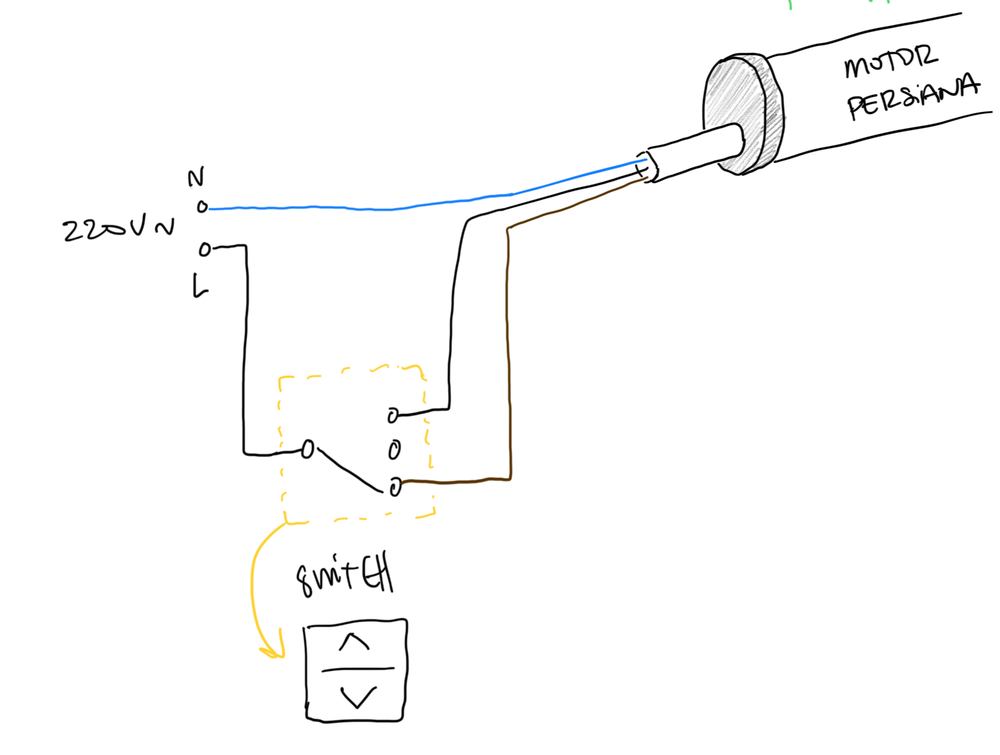
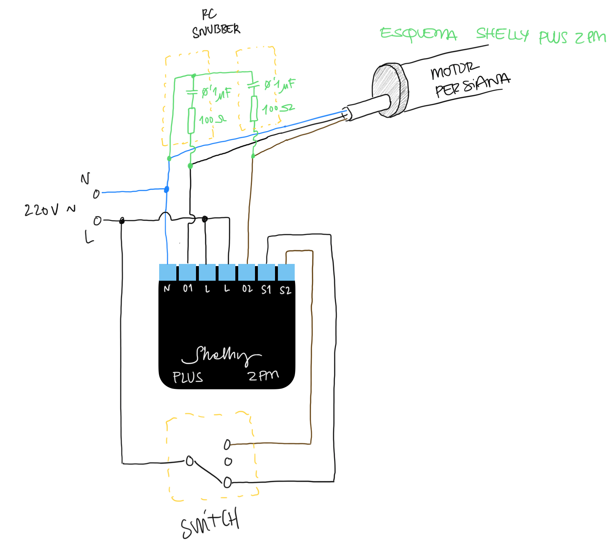

# Automatización persianas mediante `Shelly PLUS 2PM`

## Pasos previos

Calcular el tiempo de apertura y cierre de nuestra persiana, de forma exacta, mediante el uso de un cronómetro.

## Esquemáticos

Antes de iniciar con la instalación y configuración del **Shelly PLUS 2PM** para automatizar nuestra persianas, debemos conocer el equema de nuestra persisana motorizada.
En mi caso, y suele ser el esquema más habitual, mi persiana dispone del siguiente conexionado:

Tal y como indica el fabricante, para poder automatizar mis persianas, el conexionado del **Shelly** debe ser el detallado en la imagen adjunta:

Por lo que el circuito final debe ser el detallado a continuación:

## Flasheo del dispositivo para instalar HAA

El _flasheo_ del dispositivo para la instalación del _firmware_ **HAA** está detallado en la documento [Flash Shelly](../../docs/flash_shelly.md)

## MELPHAA

En mi caso, tal y como se detalla al principio, tras calcular los tiempos de apertura y cierre se configurará el `melphaa` con dichos parámetros, en mi caso, un tiempo de apertura de 23 segundos y un tiempo de cierre de 20 segundos.
Para customizarlos, basta con modificar las variables del _json_ `"o": 23, "c": 20` dónde **o** es el tiempo de apertura y **c** y el tiempo de cierre en segundos.
El `MELPHAA` utilizado para la confguración del dispositivo, así como su explicación, está documentado en [Melphaa Shelly Persiana](../../melphaa/sheely-plus-2PM-persiana.md)
